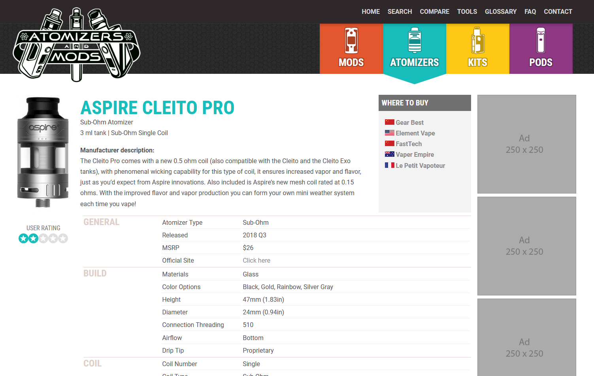
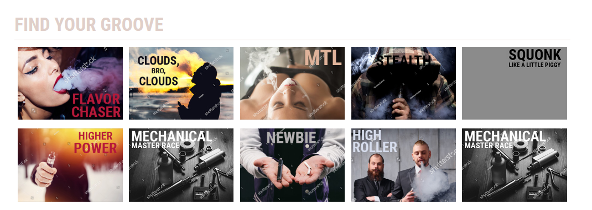
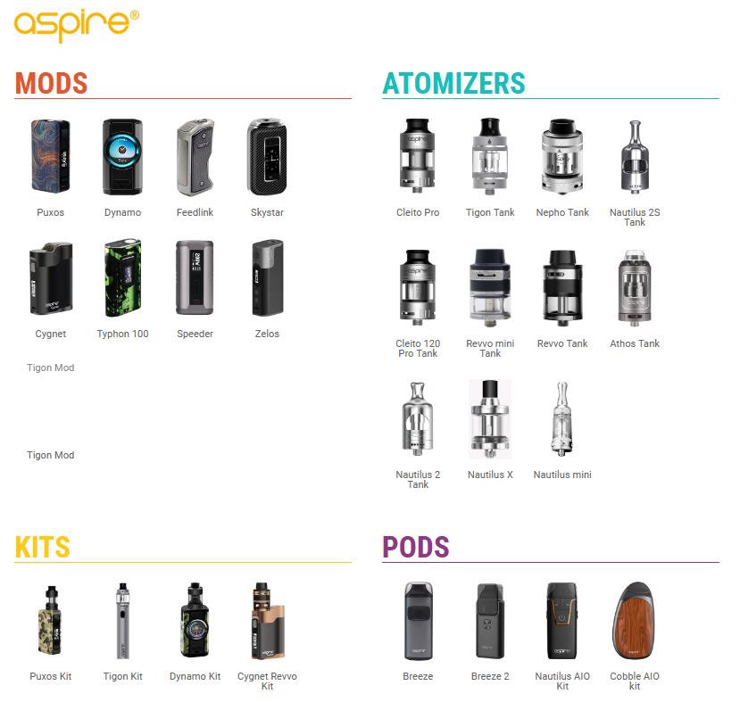
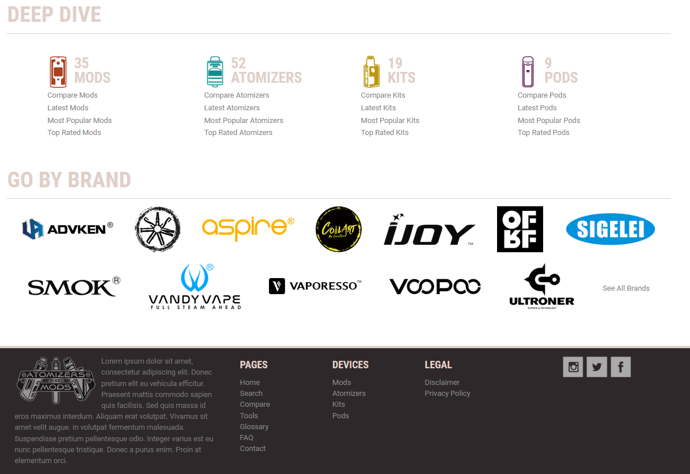

Atomizers and Mods is a project that I embarked on witha friend with the idea of making a reference database for vape enthusiasts that would give them a one-stop-shop source of information for various types of vape gear. Namely, atomizers, mods, complete kits and all-in-one pods.

## The Idea

To be upfront I don't vape (nor smoke) and never have. But I do see the positives of it as a way to help people who can't completely give up nicotine switch over to a less harmful option. I also appreciate there is a negative side to vaping (as it's considered by some to be too enticing for children and young people who don't yet smoke), but in my opinion the pros outweigh the cons, if you'd like to see *less smoking* overall.

My friend is the big vape enthusiast and he was in charge of figuring out what data is important and getting it. Basically knowing not just the gear, but the whole ecosystem of people, technical details, official terminology as well as slang. The whole idea and purpose behind the project was that there's no single well-organized, unbiased and easy to research place on the web where you can get all the info on the various gear that is used for putting togehter these custom and semi-custom devices. There's reference sites like this for most other tech that have a community of users (smartphones, camera gear etc), some are good, some less good. But for vape gear there was nothing like it. Yet.

My role? I was the web guy. My job was pretty much everything else.

## The Data

The first thing was organizing the data and displaying it in a easy to parse and understand format. We broke it down into four primary categories: Mods, Atomizers, Kits and Pods. Then we took all the relevant info about each type of device, from size and weight to wattage and electircal resistance and built a database schema around it. The idea was to have an advanced search where you can filter down from hundreds or thousands of devices to *exactly* what you need and compare easily.

For the back-end I set up a Directus instance in order to have an easy to use back-end for data entry. There was no quicker way to actually get the data other than manually thrawling manufacturer's sites for it. That's precisely why a site like this would provide a lot of value. But because nothing is standardized crawling for the data is pretty much impossible, and this would turn out to be one of the biggest stumbling blocks of the entire project - just the sheer amount of time that needs to be spent to populate all of it.

## The Design

For the design it only made sense to go big and bold. Almost to the point of tackyness in some places, but we wanted a look that was in sync with the unique style and visual language of the vape culture. And that language is colorful. Boy, is it colorful. So my idea was to color code our primary categories in, well not quite primary colors, but close. It can be a real balancing act to go so vibrant but at the same time not make it gaudy.

I mean, the headings *were* hot pink.

## The Code

I coded the business end of the site in straight PHP, since that's what I'm most confortable with. It would take the data from the Directus API and display listings, individual devices and everything else needed.

## Other Features

We planned on a bunch of other features as we moved down the road. A big one would have been a price comparison widget where you can see all the online stores that have the device listed, and their current price, making shopping around a breeze.

As for opinions on the devices, the idea was to embed a bunch of video reviews for each device from a list of reputed vape reviewers on YouTube. Another opinion section would be user comments on the site itself. This was a tentative feature, as those can easily devolve into, well, less than mature conversation very quickly.

## The End

In the end, the project proved to be too much for us to handle. Real life got in the way and it slowed down and we eventually abandoned it after putting in a good 4-5 months of work on the side into it. It's a shame because it got pretty much fully designed, about half-coded and half-populated with data, but it was not meant to be.

