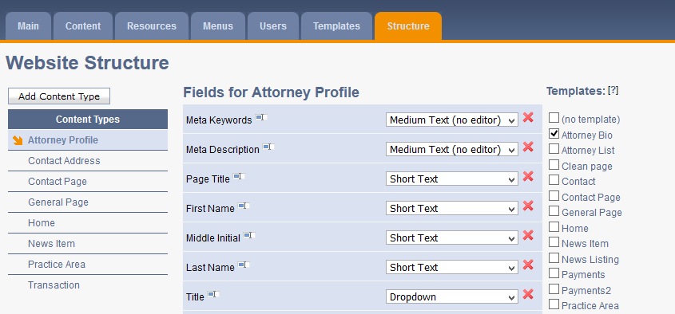
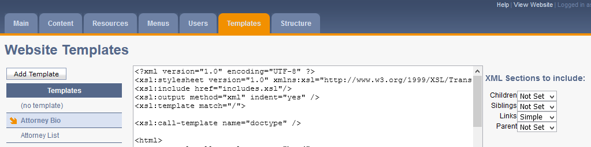

The site for Kurzman Eisenberg is featured here as it's one of the few remaining sites running on the CMS platform that I built while working at my former employer. The company is now long gone, but I support the clients that are still on it and it has shown to be a fairly robust solution for smaller companies and websites.

## Why
So, why even build your own CMS when there's so many to choose from? It's a good question, and the answer in this day and age when there's a gazillion content management systems and all other kinds of web platforms to choose from is probably "you're crazy". But, when we developed the system in 2009 (!) the internet landscape was nothing like what it is today. Sure, you had monolithic CMSs like Wordpress, Joomla, Drupal etc, but they were only a seedling of what they are today. Not to say they weren't mature products (they were), it's just that for example Wordpress was really still primarily a blogging platform and not yet the end-all be-all that it became over time. 

Also our client base was of a narrow demographic - mostly in the legal and corporate sector, without a need for all the "kids stuff"  of the emerging social internet (like I said, a different time). And they trended older, which also meant that the more unnecessary stuff we can get rid of from the interface, the better their user experience would be. In short, we wanted a tool made *for* the situation, not one that works well enough in any situation.

## The Tech Stack
As we were primarily a Microsoft shop we naturally went that route - MS SQL and .NET on the back end. On the front end I leaned into JavaScript and jQuery quite a bit, which allowed for a very responsive application.

## Features
The main section of the CMS allows for editing the content of the pages. It also features an item-to-item linking capability where the user can assign a two-way link between items that can then be displayed in the template in some way. In our case the most common use case was linking attorneys to their areas of practice and back but it got used all over for various types of content.

A Resources section handled all uploaded files, which could then be either linked to directly, or chosen from a Resource Link field in the Content section.

Menus allowed for the creation and modification of site menus in a concise way where you can add any of the items from the main tree to a menu.

User management was basic but effective. Two tiers of users, admins and regular users, where changes by regular users would have to be approved by an admin. It allowed user creation via an email invite and password resets links via email as well.

The content structure was editable via the interface as well, and made adding or modifying existing fields a breeze.

It's worth noting that regular users didn't really venture into the Templates and Structure parts of the CMS, that was mostly reserved for us devs, as for the most part, all content editing could be done under Content and Resources. The nuts and bolts of the site, contained in the two last tabs were mostly to make devs' jobs easier when creating pages and templates. Speaking of which...

## Templating (and performance)
For templating we went with building an XML data file for the requested page, and then applying an XSL template to style it. It was kind of an unorthodox solution, but it was better than writing a whole templating engine from the ground up, or having templates be a mish-mash of HTML and .NET code. Again, would I do it like that today? Certainly not, but at the time it made sense, and allowed for excellent caching options, so the system wouldn't have to do the whole XML-XSL song and dance each time a page was requested.

Since the XML data file could get quite huge on big sites where an item (page) could have many child items, as well as linked linked items (and *their* dependencies), I decided to make the XML file modular, so you could choose which parts you actually needed, and the system didn't need to generate the whole thing each time.

Templates could be changed via the built in editor, but in practice I always opted to use an IDE to modify the server files directly.

## A Site Upon It
So at long last, an example of the actual site built on this system. Kurzman Eisenberg Corbin and Lever LLP is an established law firm in White Plains, NY