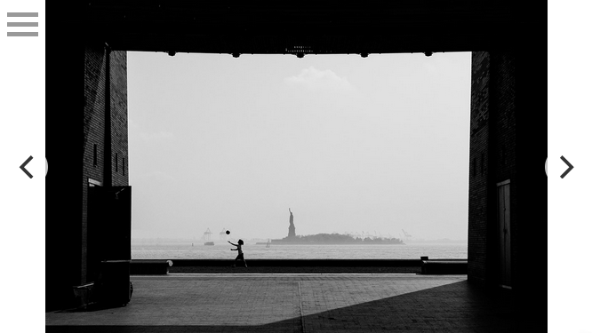
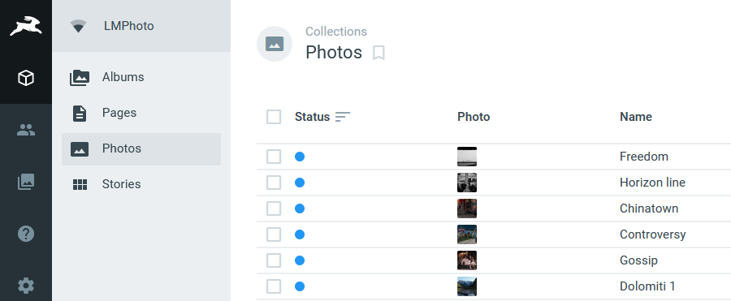
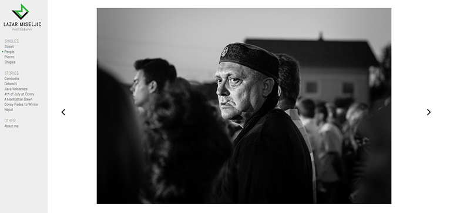

## The situation
My photo site has gone through a bunch of iterations over the years. It's main purpose is to give me a place to call home when it comes to my photography, as I'm let's say a bit social-media averse. But having a place to put all my photos is important to me as it gives me some kind of motivation to shoot more and forces at least some kind of structure upon my work.

I wanted a simple and super-clean gallery site along the lines of those of [Joseph O. Holmes](https://josephholmes.io/) or [Peter Franc](http://peterfranc.com/). I liked the idea of going without thumbnails and flicking through horizontally simulating a physical exibition, with the navigation on the side, and a simple and responsive fullscreen experience for mobile.

You would think that it would be easy to pick one of several existing options that meet that criteria, but no pre-made solution really worked. It either comes down to a pricy hosted solution or using WordPress with either a free theme which tend to be unreliable or a premium which tend to be filled to the brim with excess features and just too much general bloat for my needs. I wanted a site that's clean, not just in look but in code. I wanted it to be *fast*, easy to use, and also easy for me to modify, with very few restrictions in what I'm able to change if I want to.

## But first - the design
So, the actual design is about as simple as a website UI can get. A side nav and a big content pane for the photos and boom - done. On mobile I just gave all the screen real estate to the full screen photos with the nav hidden behind a hamburger menu. 

For the font I went with [Abel](https://fonts.google.com/specimen/Abel?preview.text_type=custom) because I wanted a typeface that's somewhat condensed in order to avoid line breaks as much as possible in the navigation pane if the album names get long.

That just left the logo. I knew I wanted a monogram, but that's about all I knew. I went through several iterations until I settled on one that is quite clear and readable, but has a few flourishes to give it a bit of character. I'm very happy with the end result.

I'm not sure how I settled on that apple green for the accent color but I'm glad I did, green in general is an underused color in design (outside of health and finance).

## The CMS
Early on I decided on a headless CMS aproach because if done right can be both faster and safer than something like Wordpress. I'd tried Directus before and liked it so I decided to use that. If you don't know what [Directus](https://directus.io/) is, it's a headless CMS that's you can pay to use as a SaaS solution, not too different than something like Contentful or Butter CMS. The big difference being that Directus is open source and free to use on your own server. But despite it being free, it's quite feature-rich and straightforward enough to set up and use (although I'll say the documentation *is* a bit thin).

One of the things that appeals to me is, if you're used to how data in SQL databases works there is very little learning curve. You just set up the schema in the admin tool and you can start shoving data in. Or, import an existing database, and Directus will just work on top of it, adopting the existing schema. Then it will spit the data back out through a REST API, which is again straightforward to consume and build the rest of your project with in whichever technology you prefer.

## The middle bit
Like I said, I wanted the whole thing to have a fairly minimal look, and there isn't really a ton of functionality that needed to be built, so I just coded a simple PHP business logic layer that talks to the API and generates the pages based on that data. There's a couple of templates and a router and that's about it.

## The front end
The only thing left was making sure that the CSS behaves nicely at all screen sizes and that the JavaScript provides a pleasant user experience when flicking or clicking through the photos. For the actual photo carousel I settled on [Flickity](https://flickity.metafizzy.co/) since I know it behaves very well on mobile and has more than enough options that I can tweak. I could have written a JS carousel from the ground up, but I'm not a masochist.

 

And that's about all there is to it. It's a fairly simple site, but personal projects tend to take us developers the longest because we're not used to the absolute freedom and no real deadlines, so we go on many sidetracks. I'm beyond glad I got this off the ground, and now all I have to do is go out to shoot more photos.